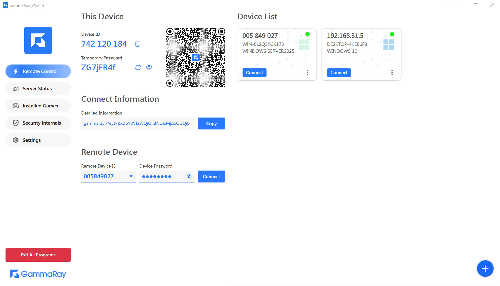
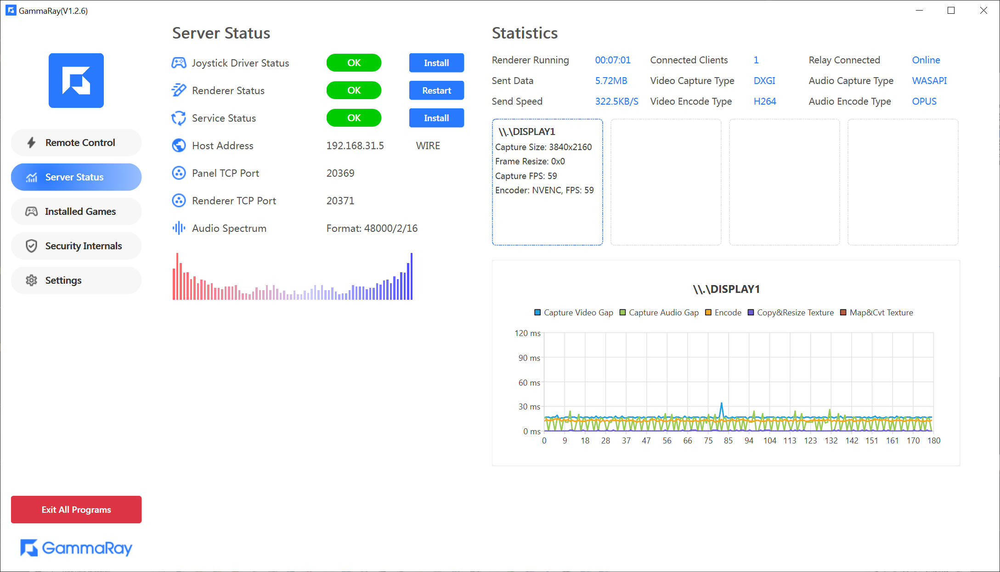
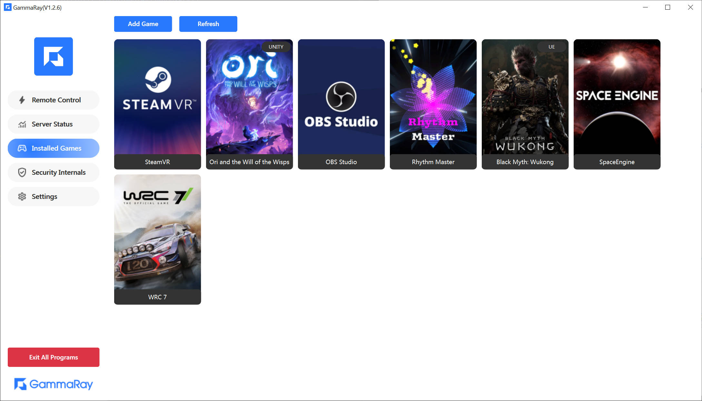
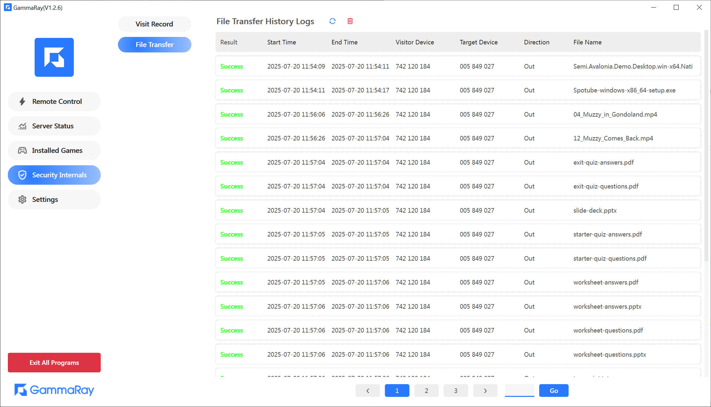
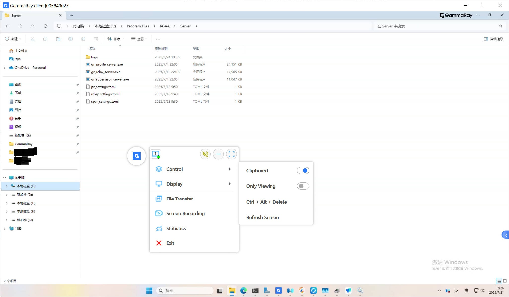
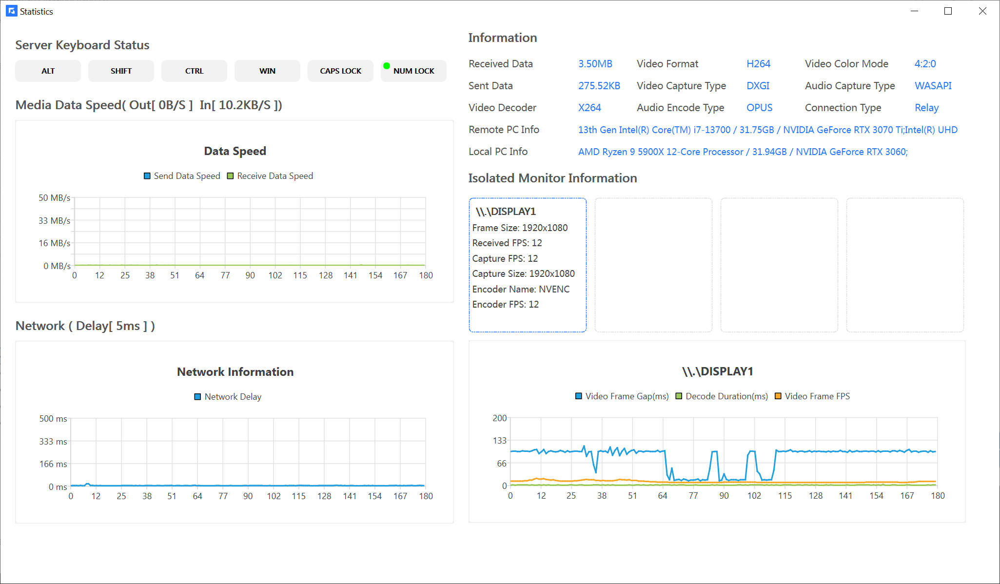

#### Warning
> In developing, please wait until 15/08/2025.  
> 我们将于2025/08/15发布新版本

#### 💖 This Repo is the OpenSource version of [GammaRay In Steam(Everything is Free, NOT released now)](https://store.steampowered.com/app/2947460/GammaRay/).
#### 💖 这是GammaRay的开源版, 全功能版移步[Steam(暂未开放下载)](https://store.steampowered.com/app/2947460/GammaRay/)或者[Release](https://github.com/RGAA-Software/GammaRay/releases), 免费.

### Showcases
[B站演示地址](https://www.bilibili.com/video/BV17mvQexELk/)  
[B站演示地址](https://www.bilibili.com/video/BV1qF5NzfENv/)  
[Youtube Introduce](..)
### Usage
##### 1. [How To Use](docs/How_to_use.md)
##### 2. [How To Build](docs/How_to_build.md)
##### 2. [How To Deploy](docs/How_to_deploy.md)
### GammaRay
#### ⚡️Stream your game fame and desktop to other devices, and replay gamepad,keyboard,mouse events on the host PC. In a word, It's a alternative of TeamViewer, ToDesk, RustDesk, etc.
#### ⚡️远程操作电脑，云游戏，模拟手柄等，类似ToDesk, 向日葵, RustDesk, TeamViewer的工具

### Support Platforms
✅  Ready  
⌛  Developing

| Platform | Client | Server  |
|----------|--------|---------|
| Windows  | ✅      | ✅       |
| Android  | ✅      | ⌛       |

### Screenshots

### Cloud/Remote Game Recordings
#### Wukong/黑神话悟空

#### Ori/奥日

#### Elden Ring/埃尔登法环

### License
##### You are permitted to use these codes free in personal, but DO NOT use it in business. If you want to use it in commerce, please contact us at: hollow.ichigo.yoo@gmail.com 
##### 个人免费使用，请勿私自商用，如有商用需求，请联系我们。
