#### [简体中文](docs/Readme_CN.md)
#### Showcase【演示地址 B站】
[B站演示地址](https://www.bilibili.com/video/BV17mvQexELk/)

### GammaRay
##### GammaRay is a set of tools for streaming your games and desktop to other devices, and replaying gamepad/keyboard/mouse events in the host PC.
##### Attention: Please make sure all devices connectted to same Router.
### Client Repos
[PC Client Repo is here](https://github.com/RGAA-Software/GammaRayPC)  
[Android Client Repo is here](https://github.com/RGAA-Software/GammaRayAndroid)

### Main features
- Game streaming, Stream desktop & Replay events, with Android client
- Remote desktop, such as TeamViewer VNC, with PC Client
- Music visualizer
- Screen extension, by (Graphics Card Spoof)/(HDMI DDC EDID Dummy Plug)
- Support Steam "Big Picture Mode"
- Mock "XBox Game Controller" By ViGEm

### Supported Encoders
- NVENC (Nvidia GPU)
- AMF (AMD GPU)
- x264/x265 (FFmpeg)

### Recordings
#### Test (Ori)

#### Test (Elden Ring)


### How to use
#### 1.Download prebuild software in release region, 2 or 3 packages that you may need.
- Server (Capture, Encode, Replay events...)
- PC Client (Control a computer(Server) like TeamViewer)
- Android Client (Play a game by Joystick that plugged into your phone)

#### 2.Run the server
##### - 2.1 Just double-click the GammaRay.exe in server folder
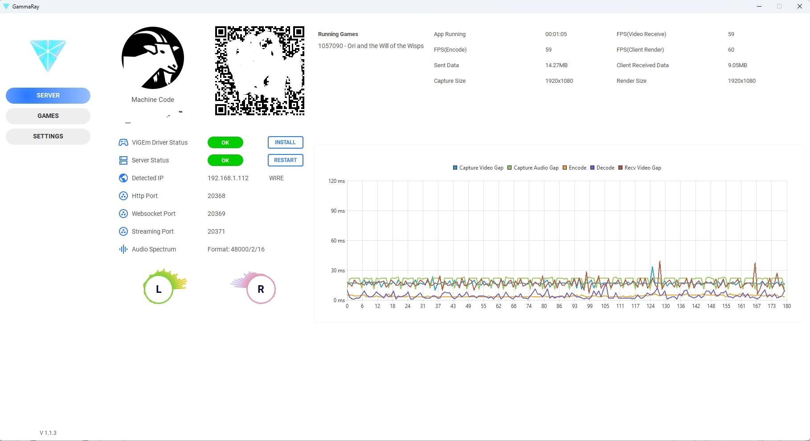

##### 2.2 If you have Steam already installed, the games info will be displayed.


##### 2.3 You can also add your own game
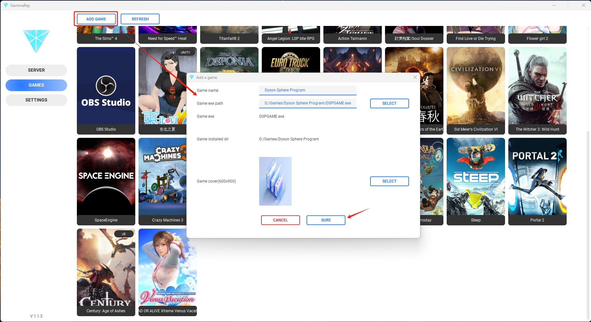

##### 2.4 Change the settings if you want
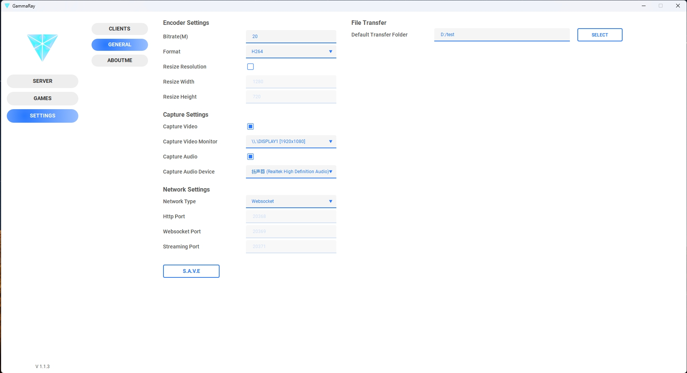

#### 3-1 Run a PC Client
#### 3-1.1 Just double-clicked the GammaRayClient.exe in PC client folder
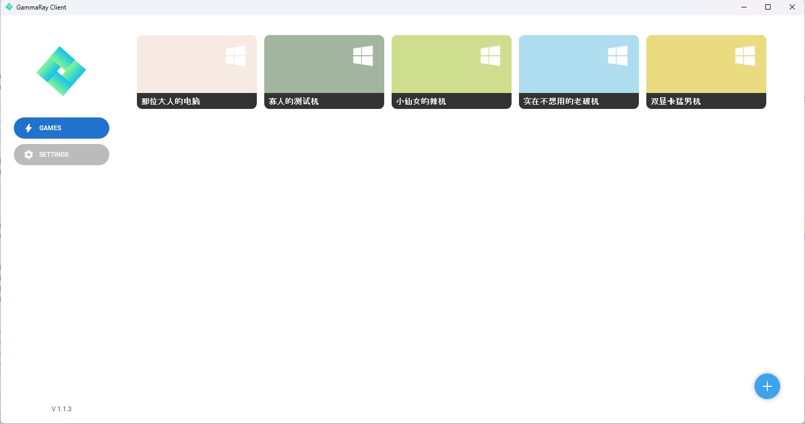

#### 3-1.2 Add a remote
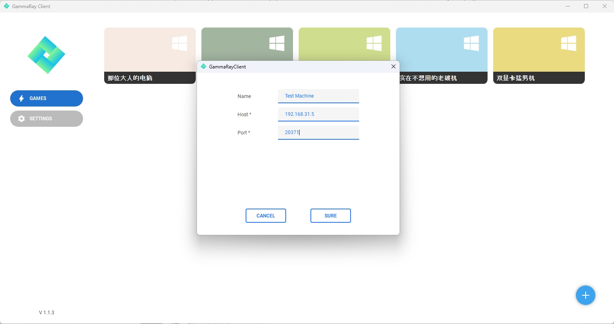

#### 3-1.3 Double-click to connect it and operate it, you can also transfer files
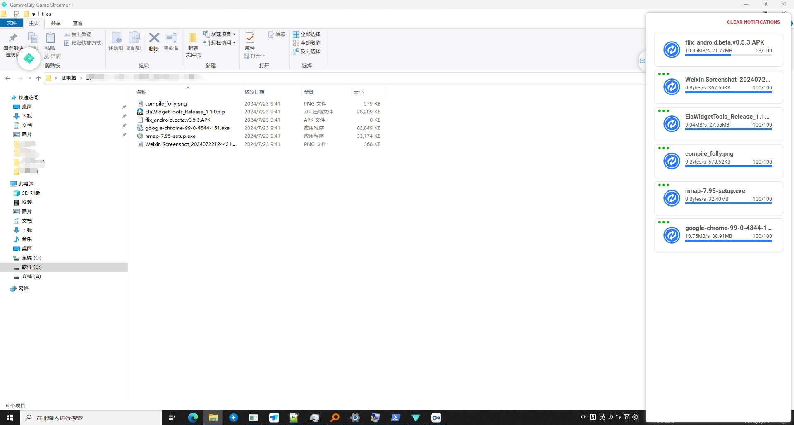

#### 3-2 Run a Android Client
> Download and install the GammaRay_Official_xxx.apk first

##### 3-2 Prepare
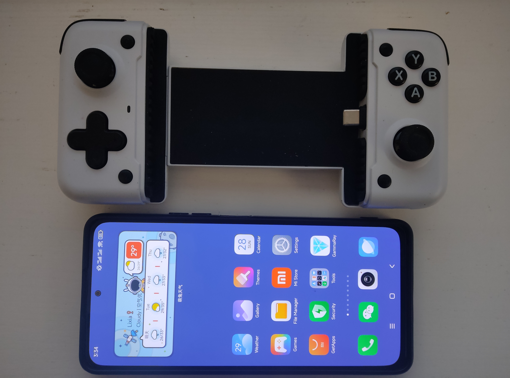

##### 3-2.1 Scan the QR in server panel, it will connect automatically.
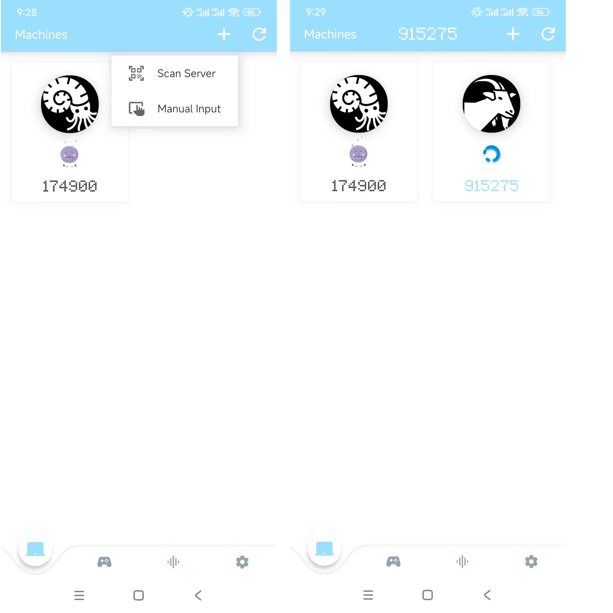

##### 3-2.2 Change to 2nd tab in the bottom, you'll see your games and 2 fixed options(Desktop, Steam Big Picture). Toch the Desktop(the first item).
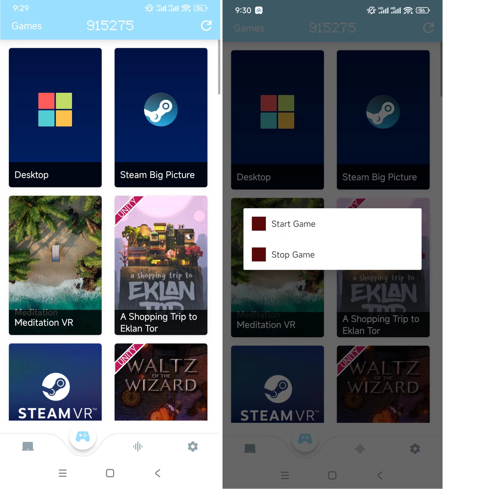

##### 3-2.3 If it connected to the server, you'll see the frame that same as your server.


##### 3-2.4 If you toch the Steam Big Picture(the second item), your Server will run the steam in Big Piture Mode. You can turn Virtual Joystick on in settings tab(the 4th tab).
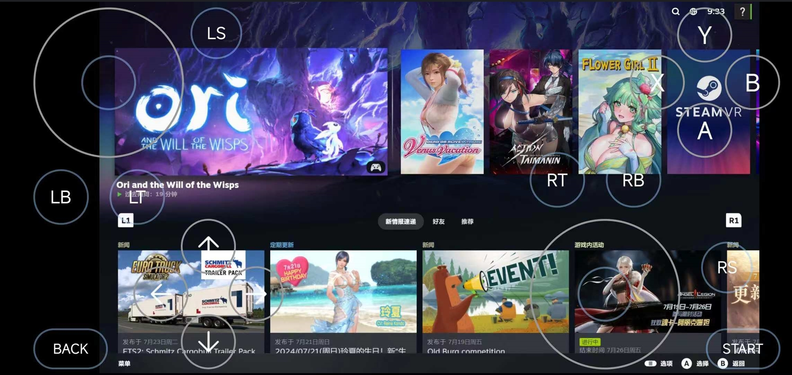
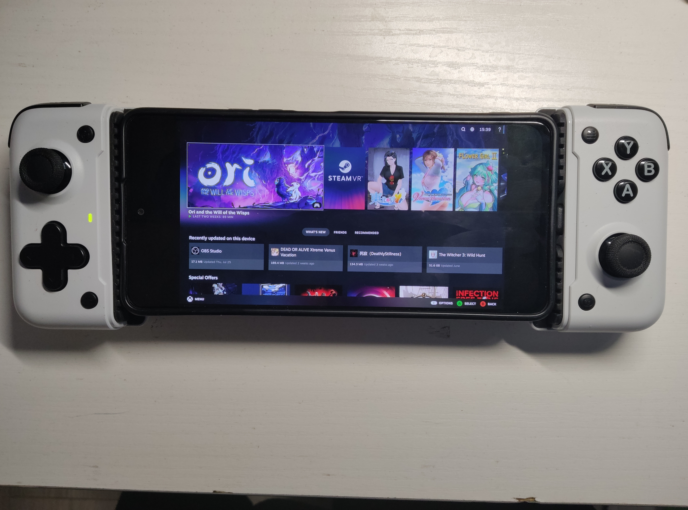
##### 3-2.5 If you just want to listen to the music that playing on your Server, you can switch to the 3rd tab, there are some buildin music spectrum effects, examples:
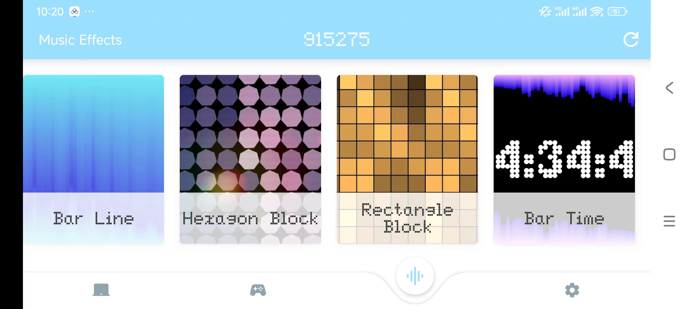
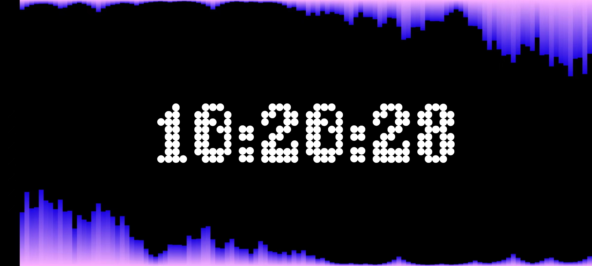
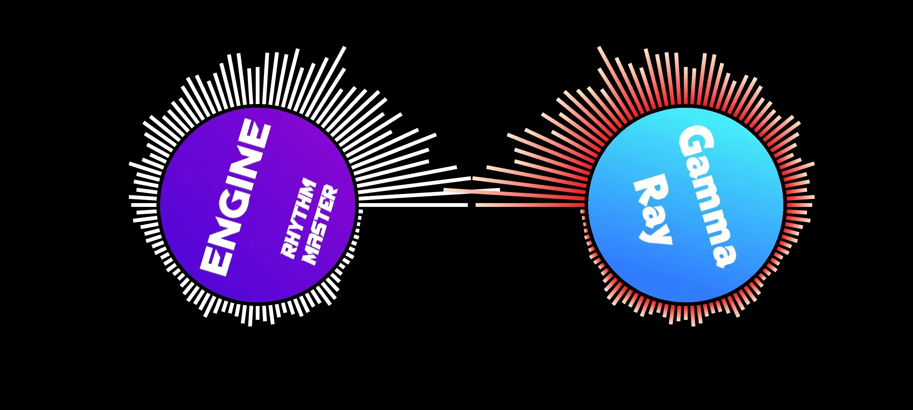
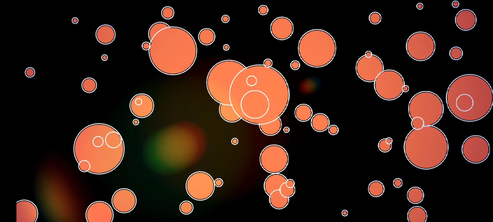

### How to build
#### 1. Clone the repo
```c++
    git clone --recursive 
```

#### 2. Install dependencies by VCPKG in 3rdparty.
- 2.1 Change to VCPKG folder
```c++
    cd {your-project-folder}/deps/tc_3rdparty/vcpkg
```
- 2.2 Install vcpkg.exe
```c++
    .\bootstrap-vcpkg.bat 
```
- 2.3 Install dependencies
```c++
    .\vcpkg.exe install gflags:x64-windows
    .\vcpkg.exe install sqlite3:x64-windows
    .\vcpkg.exe install detours:x64-windows
    .\vcpkg.exe install gtest:x64-windows
    .\vcpkg.exe install libvpx:x64-windows
    .\vcpkg.exe install opus:x64-windows
    .\vcpkg.exe install protobuf:x64-windows
    .\vcpkg.exe install fftw3:x64-windows
    .\vcpkg.exe install poco:x64-windows-static
    .\vcpkg.exe install easyhook:x64-windows
    .\vcpkg.exe install glm:x64-windows
    .\vcpkg install boost:x64-windows
```

- 2.4 You can open the project by Visual Studio 2022 or Clion, solve the problems and then compile the project.
- 2.5 Really hard to build the project? You may download the prebuild binary...

### License
##### You are permitted to use these codes free in personal, but DO NOT use it in business. If you want to use it in commerce, please contact me at: hollow.ichigo.yoo@gmail.com
