#### 💖 This Repo is the OpenSource version of [GoDesk In Steam(NOT released now)](https://store.steampowered.com/app/2947460/GoDesk/), please download at [HERE](https://github.com/RGAA-Software/GammaRay/releases)
#### 💖 这是GoDesk的开源版, 全功能版移步[Steam(暂未开放下载)](https://store.steampowered.com/app/2947460/GoDesk/)或者[Release](https://github.com/RGAA-Software/GammaRay/releases), 免费.

### Showcases
[企业功能演示](https://www.bilibili.com/video/BV1ZGDhBGEAA/)  
[B站演示地址](https://www.bilibili.com/video/BV17mvQexELk/)  
[B站演示地址(远程桌面)](https://www.bilibili.com/video/BV1qF5NzfENv/)  

## Usage
##### 1. [How To Use](docs/How_to_use.md)
##### 2. [How To Build](docs/How_to_build.md)
## More
#### [Official Site (官网)](https://godesk.uk)
#### [Documentation (文档)](https://docs.godesk.uk)

### GammaRay
#### ⚡️Stream your game fame and desktop to other devices, and replay gamepad,keyboard,mouse events on the host PC. In a word, It's a alternative of TeamViewer, ToDesk, RustDesk, etc.
#### ⚡️远程操作电脑，云游戏，模拟手柄等，类似ToDesk, 向日葵, RustDesk, TeamViewer的工具

## Support Platforms
✅  Ready  
⌛  Developing

| Platform | Client | Server  |
|----------|--------|---------|
| Windows  | ✅      | ✅       |
| Android  | ✅      | ⌛       |

## Work Mode (工作模式)
#### 1. Connect Directly (直连)

#### 2. Relay (转发)
> You can also connect directly in this mode  
> 此模式下亦可直连  

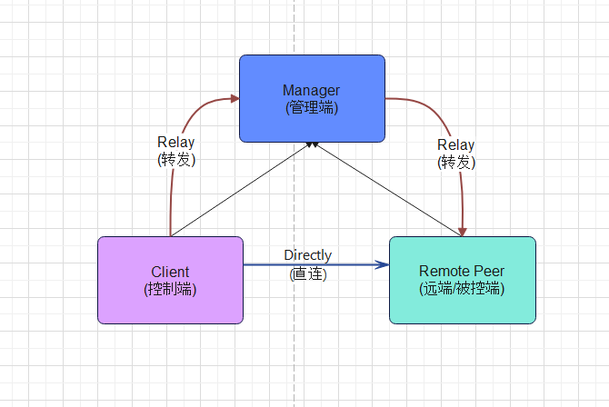

## Key Features
### Display multiple screens of remote computers
#### Switch display

#### simultaneous display

### File transfer
#### The transmission speed is very fast
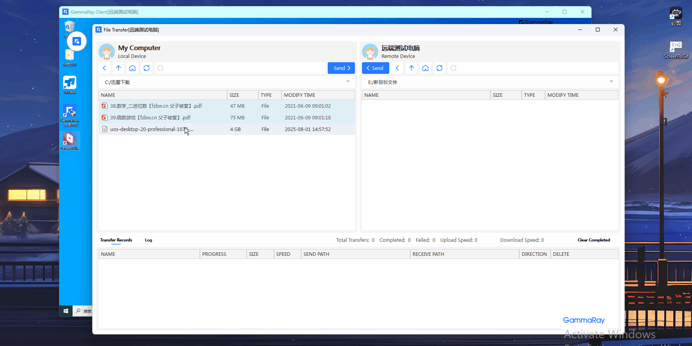
### Transferring files via clipboard
#### The transmission speed is very fast
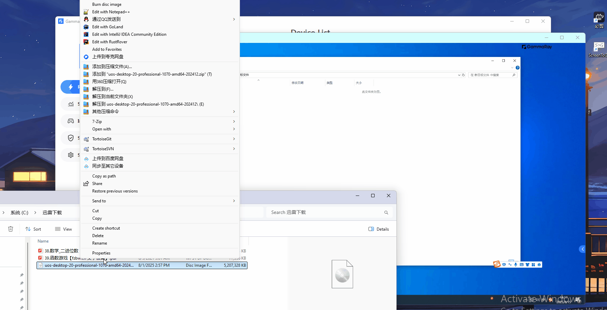

### Screen Recording
#### Supports simultaneous recording on multiple screens

### Detailed statistical information
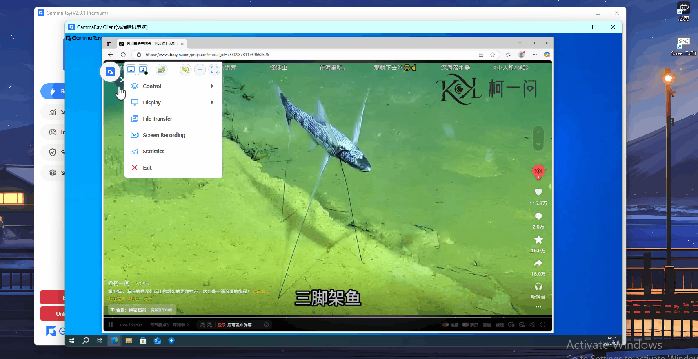

### Cloud/Remote Game Recordings
#### Wukong/黑神话悟空

#### Ori/奥日

#### Elden Ring/埃尔登法环

### Music Spectrum
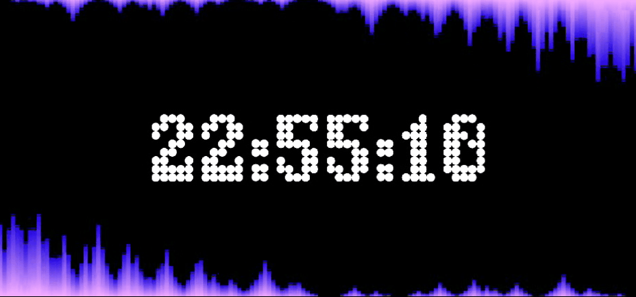
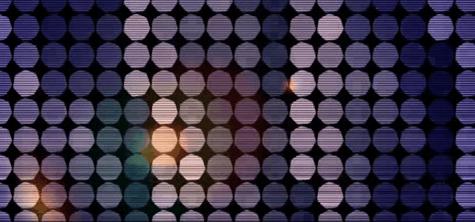
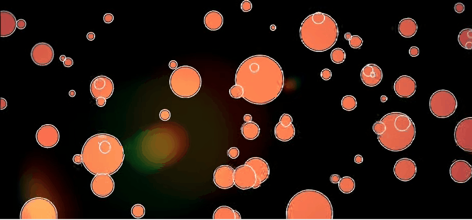

### Screenshots
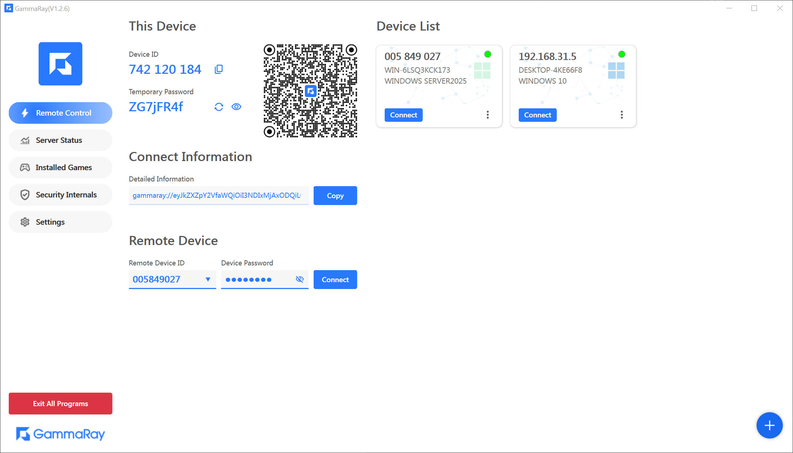
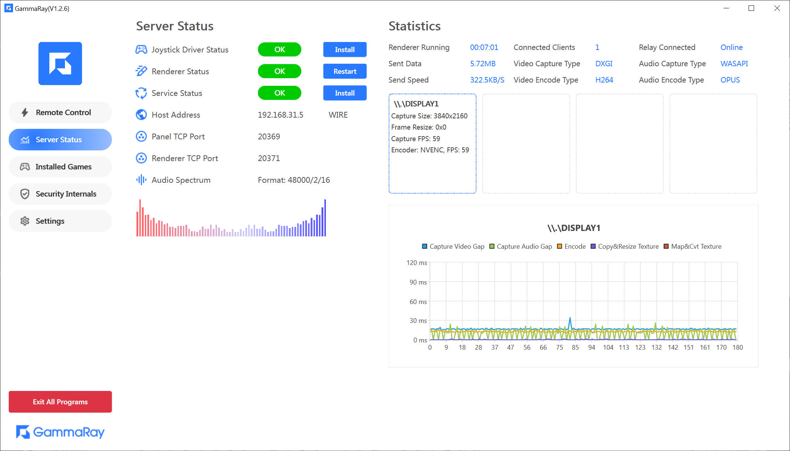
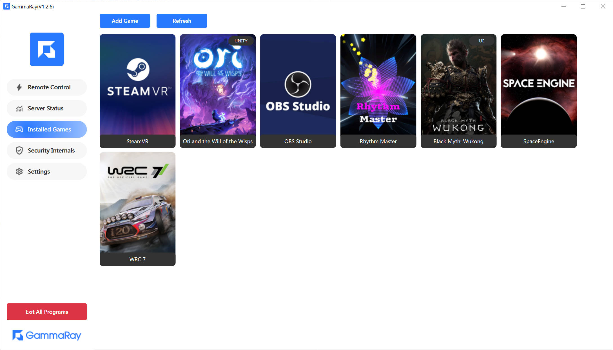
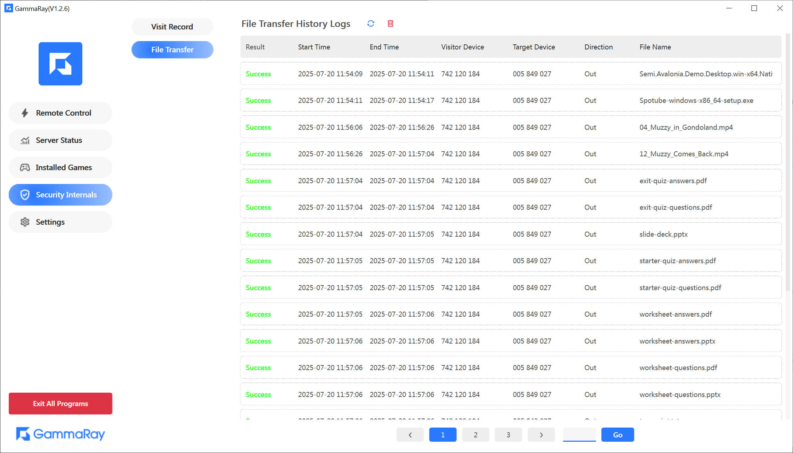
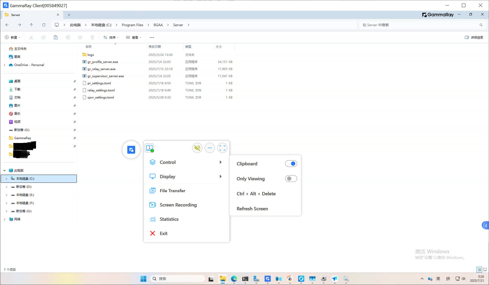
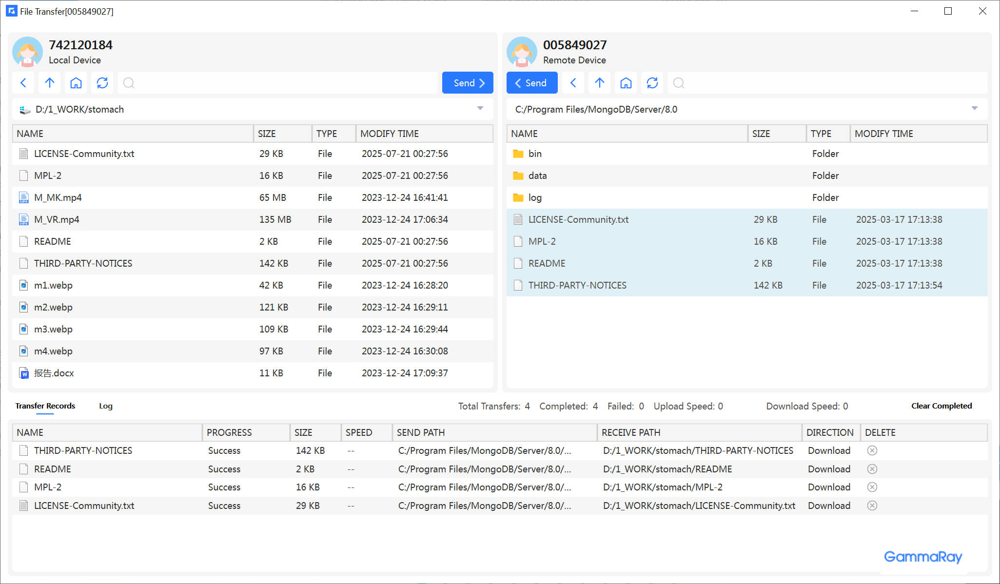
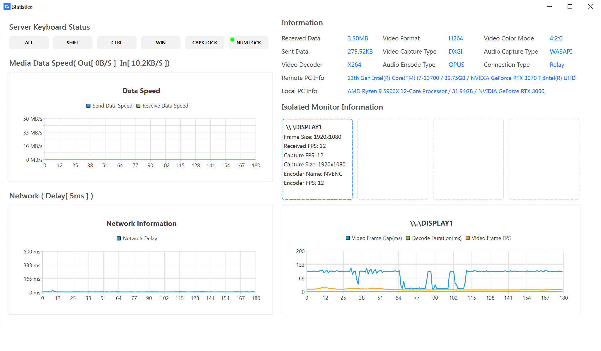

### License
##### You are permitted to use these codes free in personal, but DO NOT use it in business. If you want to use it in commerce, please contact us at: hollow.ichigo.yoo@gmail.com chengdudreamer@gmail.com
##### 个人免费使用，请勿私自商用，如有商用需求，请联系我们。
