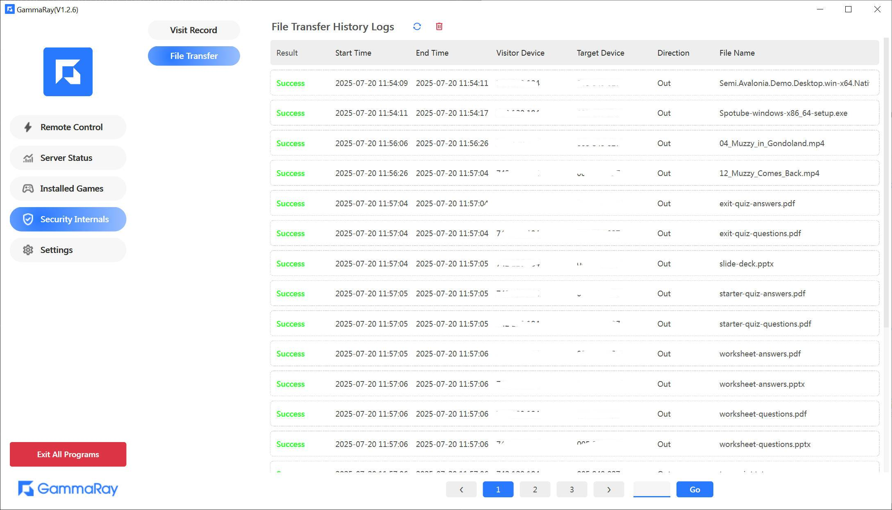

#### Warning
> In developing, please wait until 15/08/2025.

#### 💖 This Repo is the OpenSource version of [GammaRay In Steam(Everything is Free)](https://store.steampowered.com/app/2947460/GammaRay/).
#### 💖 这是GammaRay的开源版, 全功能版移步[Steam](https://store.steampowered.com/app/2947460/GammaRay/)或者[Release](https://github.com/RGAA-Software/GammaRay/releases), 免费.

### Showcases
[B站演示地址](https://www.bilibili.com/video/BV17mvQexELk/)  
[Youtube Introduce](..)

### GammaRay
#### ⚡️Stream your games and desktop to other devices, and replay gamepad,keyboard,mouse events on the host PC. In a word, It's a alternative of TeamViewer, ToDesk, RustDesk, etc.
#### ⚡️类似ToDesk, 向日葵, RustDesk, TeamViewer的工具，可远程操作电脑，模拟手柄玩游戏

### Screenshots

### Recordings
#### Test Wukong

#### Test (Ori)

#### Test (Elden Ring)

#### 1. [How To Use](docs/How_to_use.md)
#### 2. [How To Build](docs/How_to_build.md)
#### 2. [How To Deploy](docs/How_to_deploy.md)

### License
##### You are permitted to use these codes free in personal, but DO NOT use it in business. If you want to use it in commerce, please contact me at: hollow.ichigo.yoo@gmail.com   
