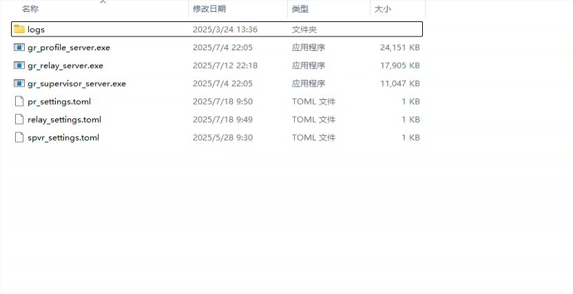
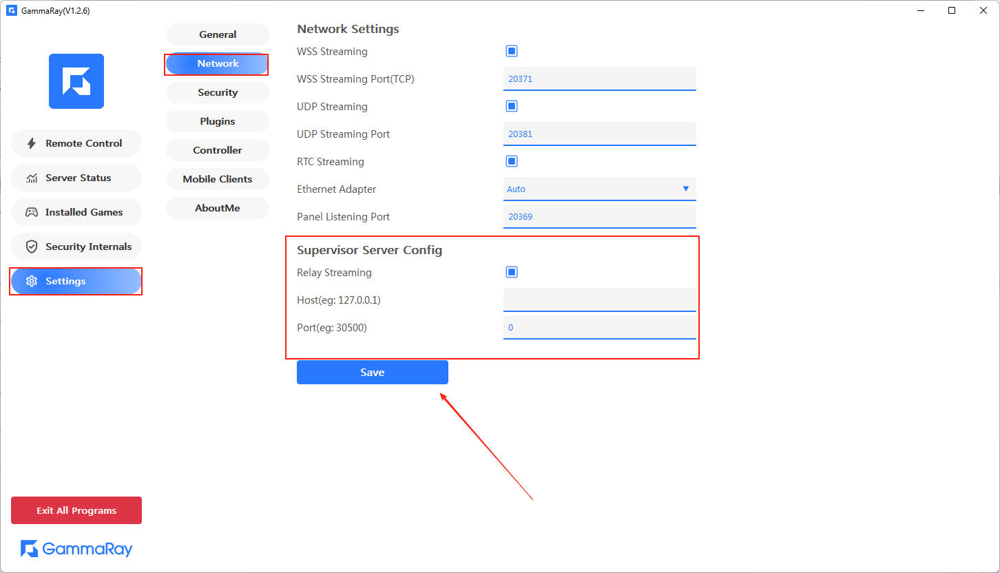
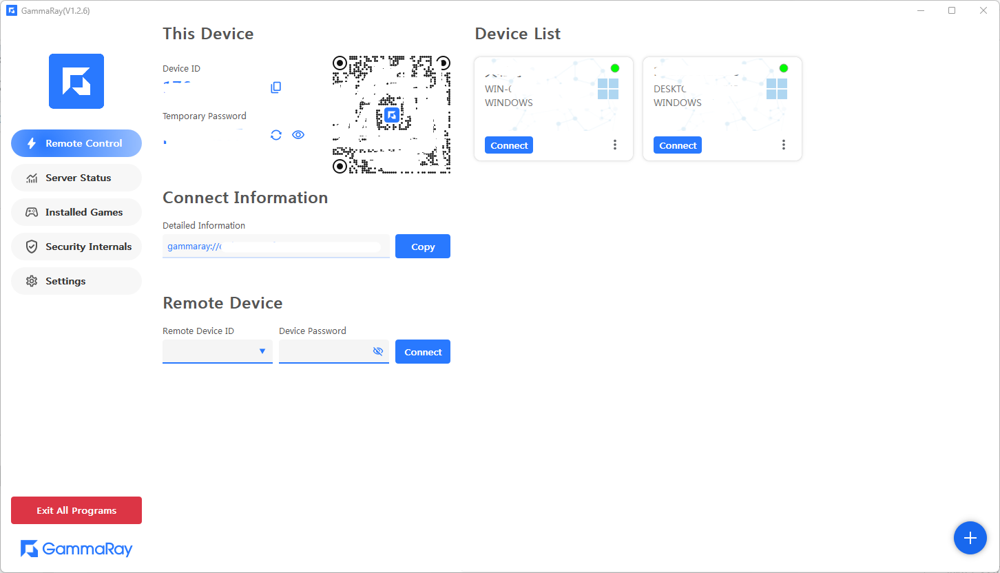

#### 1. Prepare
> 1.1 Install **Redis**  
> 1.2 Install **MongoDB**
> 

#### 2. Download server binaries
##### [Github Link](https://github.com/RGAA-Software/GammaRay/releases)

#### 3. There are 3 binaries
> 3.1 **Profile** ==> Generate ID  
> 3.2 **Relay**  ==>  Relay the media info  
> 3.3 **Supervisor**  ==> Facade of Profile and Relay, a CMS like server.



#### 4. Modify the settings
> You MUST change the **server_w3c_ip** / **server_local_ip** fields to your own
> 
##### 4.1 Profile settings
```toml
# name
server_name = "Srv.Profile.01"

# w3c ip
###################################
# Must make your own !!!
server_w3c_ip = ""
###################################

# local ip
###################################
# Must make your own !!!
server_local_ip = "192.168.1.12"
###################################

# grpc server port
server_grpc_port = 40401

# working server port
server_working_port = 40301

# spvr server ip
###################################
# TO [4.3] Spvr server, keep this if servers in the same machine
spvr_server_ip = "127.0.0.1"

# spvr server port
spvr_server_port = 40300

# mongodb url
mongodb_url = "mongodb://localhost:27017/"
```

##### 4.2 Relay settings
```toml
# name
server_name = "Srv.Relay.01"

# w3c ip
###################################
# Must make your own !!!
server_w3c_ip = ""
###################################

# local ip
###################################
# Must make your own !!!
server_local_ip = "192.168.1.12"
###################################

# grpc server port
server_grpc_port = 40402

# working server port
server_working_port = 40302

# spvr server ip
###################################
# TO [4.3] Spvr server, keep this if servers in the same machine
spvr_server_ip = "127.0.0.1"
###################################

# spvr server port
spvr_server_port = 40300

# redis url address
redis_url = "redis://127.0.0.1:6379/"
```

##### 4.3 Spvr settings
```toml
# name
server_name = "Srv.Supervisor.01"

# port
server_port = 40300

# single deploy
single_deploy = true

# show ui
show_ui = true
```

#### 5. Run the servers
> No orders required here, just starting them as you want.  
> You may start in sequence of gr_profile_server.exe -> gr_relay_server.exe -> gr_supervisor_server.exe
> 
#### 6. Set the information in Panel and save it.


#### 7. Then, you'll get your device id
