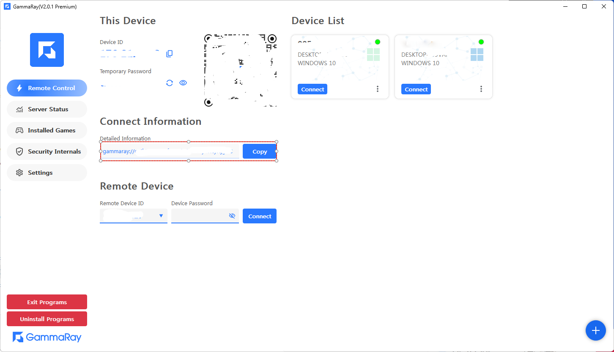
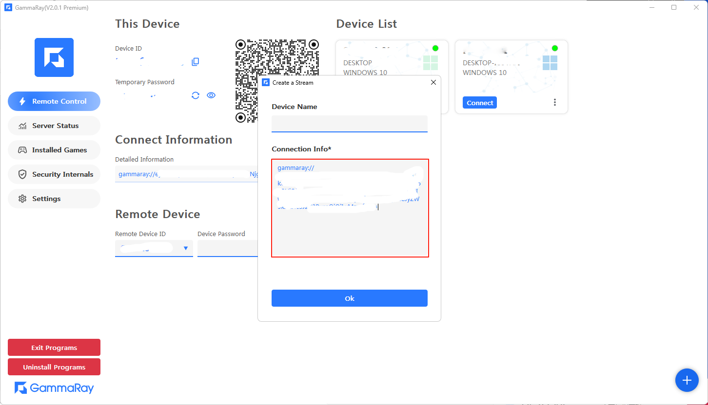
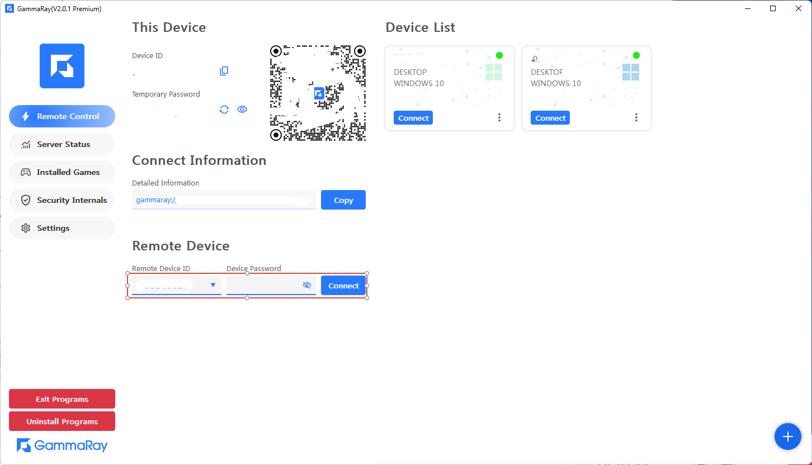

#### 1. 准备工作
> 1.1 安装 **Redis**  
> 1.2 安装 **MongoDB**  
> PS:   
> Linux下使用命令直接安装即可。  
> Windows下使用安装包：  
> Redis下载地址： https://github.com/redis-windows/redis-windows/releases  
> MongoDB下载地址：https://www.mongodb.com/try/download/community


#### 2. 下载服务端程序
##### [Github Link](https://github.com/RGAA-Software/GammaRay/releases)

#### 3. 有2个可执行文件，配置好后直接运行即可
```
.
├── certs/
│   ├── cert.pem
│   └── key.pem
├── gr_spvr_server --> 生成管理设备ID
├── gr_spvr_settings.toml
├── gr_relay_server --> 转发数据
└── gr_relay_settings.toml

```

#### 4. 修改配置
> 必须把这个字段 **server_w3c_ip** 改成自己服务器的外网地址 
> 
#### SPVR Server
```toml
# 如果mongodb装在本机，只需要改一下外网地址即可
# If your mongodb installed in same machine, just to modify the [server_w3c_ip] to your External Ip.

# name
server_name = "Srv.Supervisor.01"

# 此机器的外网IP
# w3c ip
server_w3c_ip = "192.168.1.111"

# 需要对外开放的端口
# port
server_port = 30500

# single deploy
single_deploy = true

# show ui
show_ui = true

# 如果mongodb装在本机，不用修改
# mongodb url
mongodb_url = "mongodb://localhost:27017/"
```

#### Relay Server
```toml
# name
server_name = "Srv.Relay.01"

# 此机器的外网IP
# w3c ip
server_w3c_ip = "192.168.1.111"

# 需要对外开放的端口
# working server port
server_working_port = 30600

# SPVR服务如果运行在同一台电脑，不需要修改
####### SPVR Server IP #######
# spvr server ip
spvr_server_ip = "127.0.0.1"

# SPVR服务如果运行在同一台电脑，不需要修改
####### SPVR Server PORT #######
# spvr server port
spvr_server_port = 30500

# redis装在本机，则不需要修改
# redis url address
redis_url = "redis://127.0.0.1:6379/"

# 无特殊需求，不用修改
# grpc server port
# <Inner Used>
server_grpc_port = 40600
```

#### 5. 启动服务
> 没有固定的顺序，先启动哪个服务都可以  

#### 6. 设置服务信息.


#### 7. 获取到ID即可使用中转服务


#### 8. 有2种方式进行链接
##### 8.1 使用连接信息, 拷贝想要远程的机器信息，直接在客户端连接即可


##### 8.2 使用ID和密码连接

