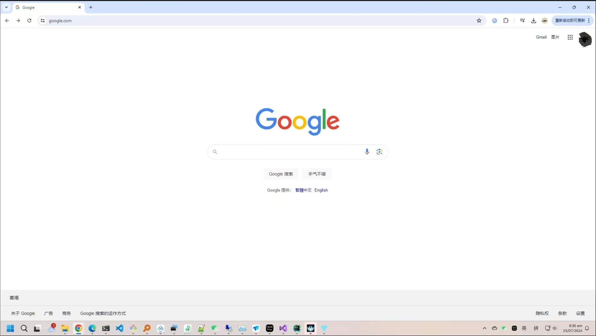

#### [简体中文](Readme_CN.md)

### GammaRay
##### GammaRay包含一系列软件，能将您的游戏和桌面采集，编码并传送到其他设备, 并且在服务器（运行游戏的电脑）上重放（模拟）手柄，鼠标，键盘事件。
##### 请确保所有的设备连接到了同一台路由器。

### Client Repos
[PC Client代码在这里](https://github.com/RGAA-Software/GammaRayPC)  
[Android Client代码在这里](https://github.com/RGAA-Software/GammaRayAndroid)

### Main features
- 游戏串流，采集传输桌面画面，声音 & 重放手柄，键盘，鼠标事件
- 远程桌面，像Todesk和向日葵一样，远程操控电脑
- 使用显卡欺骗器扩展屏幕
- 自动搜索显示Steam安装的游戏
- 支持Steam大屏模式
- Android客户端支持音乐可视化效果
- 使用ViGEm模拟"XBox"手柄

### 支持的编码器
- NVENC (英伟达硬编)
- AMF (AMD硬编)
- x264/x265 (FFmpeg软编)

### Recordings
#### Test Wukong

#### Test (Ori)

#### Test (Elden Ring)


### 怎样使用
#### 1.在右侧Release区域下载预编译的程序
- 服务端 (Capture, Encode, Replay events...)
- PC客户端 (Control a computer(Server) like TeamViewer)
- Android端 (Play a game by Joystick that plugged into your phone)

#### 2.启动服务
##### - 2.1 服务解压后，双击GammaRay.exe即可启动


##### 2.2 如果您安装了Steam，会自动扫描安装的游戏


##### 2.3 如果您有不知名渠道得到的游戏，也可以手动添加


##### 2.4 根据需要调整设置


#### 3-1 运行PC客户端
#### 3-1.1 解压后双击GammaRayClient.exe即可


#### 3-1.2 添加一个远程连接


#### 3-1.3 双击这个条目即可启动，连上后可以操作远程电脑，也可以传输文件


#### 3-2 运行Android客户端
> 现在并且安装 GammaRay_Official_xxx.apk
##### 3-2 准备


##### 3-2.1 扫描服务器上的二维码，它将自动连接


##### 3-2.2 切换到第二页，您就可以看见自己的游戏和2个固定的项目(Desktop, Steam Big Picture). 点击Desktop(第一个).


##### 3-2.3 连接成功后，您就能在手机上看见服务端的画面


##### 3-2.4 点击Steam Big Picture(第二个),您的服务器将把Steam运行在大屏模式. 您也可以在设置中打开虚拟手柄.


##### 3-2.5 如果您只想听听歌，切换到第三页，这里预置了几个音乐可视化的效果:


### 如何编译
#### 1. Clone the repo
```c++
    git clone --recursive 
```

#### 2. 使用vcpkg安装依赖
- 2.1 Change to VCPKG folder
```c++
    cd {your-project-folder}/deps/tc_3rdparty/vcpkg
```
- 2.2 Install vcpkg.exe
```c++
    .\bootstrap-vcpkg.bat 
```
- 2.3 Install dependencies
```c++
    .\vcpkg.exe install gflags:x64-windows
    .\vcpkg.exe install sqlite3:x64-windows
    .\vcpkg.exe install detours:x64-windows
    .\vcpkg.exe install gtest:x64-windows
    .\vcpkg.exe install libvpx:x64-windows
    .\vcpkg.exe install opus:x64-windows
    .\vcpkg.exe install protobuf:x64-windows
    .\vcpkg.exe install fftw3:x64-windows
    .\vcpkg.exe install poco:x64-windows-static
    .\vcpkg.exe install easyhook:x64-windows
    .\vcpkg.exe install glm:x64-windows
    .\vcpkg install boost:x64-windows
```

- 2.4 使用Visual Studio 2022 or Clion打开, 解决依赖问题后，就可以编译项目了.
- 2.5 编译c++太痛苦？那就直接下载预编译好的吧。

### License
##### 个人项目随意使用, 但不要用于商业中. 如果您想商业使用，请联系: hollow.ichigo.yoo@gmail.com